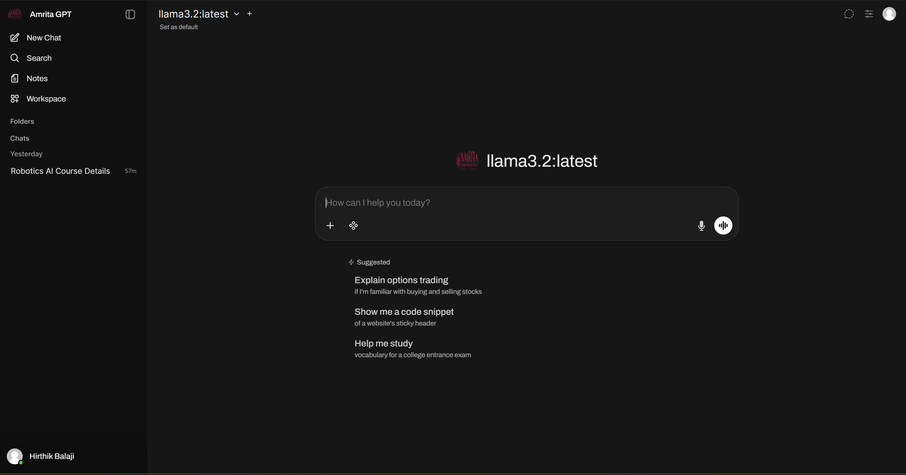

# Amrita GPT 👋


[](https://twitter.com/AmritaUniversity)


**Amrita GPT is an [extensible](https://github.com/HirthikBalaji/AmritaGPTfeatures/extensibility/plugin), feature-rich, and user-friendly self-hosted AI platform designed to operate entirely offline.** It supports various LLM runners like **Ollama** and **OpenAI-compatible APIs**, with **built-in inference engine** for RAG, making it a **powerful AI deployment solution**.

Passionate about open-source AI? [Join our team →](https://github.com/HirthikBalaji/AmritaGPT)



> [!TIP]  
> **Looking for an [Enterprise Plan](https://github.com/HirthikBalaji/AmritaGPT)?** – **[Speak with Our Sales Team Today!](https://github.com/HirthikBalaji/AmritaGPT)**
>
> Get **enhanced capabilities**, including **custom theming and branding**, **Service Level Agreement (SLA) support**, **Long-Term Support (LTS) versions**, and **more!**

For more information, be sure to check out our [Amrita GPT Documentation](https://github.com/HirthikBalaji/AmritaGPT).

## Key Features of Amrita GPT ⭐

- 🚀 **Effortless Setup**: Install seamlessly using Docker or Kubernetes (kubectl, kustomize or helm) for a hassle-free experience with support for both `:ollama` and `:cuda` tagged images.

- 🤝 **Ollama/OpenAI API Integration**: Effortlessly integrate OpenAI-compatible APIs for versatile conversations alongside Ollama models. Customize the OpenAI API URL to link with **LMStudio, GroqCloud, Mistral, OpenRouter, and more**.

- 🛡️ **Granular Permissions and User Groups**: By allowing administrators to create detailed user roles and permissions, we ensure a secure user environment. This granularity not only enhances security but also allows for customized user experiences, fostering a sense of ownership and responsibility amongst users.

- 📱 **Responsive Design**: Enjoy a seamless experience across Desktop PC, Laptop, and Mobile devices.

- 📱 **Progressive Web App (PWA) for Mobile**: Enjoy a native app-like experience on your mobile device with our PWA, providing offline access on localhost and a seamless user interface.

- ✒️🔢 **Full Markdown and LaTeX Support**: Elevate your LLM experience with comprehensive Markdown and LaTeX capabilities for enriched interaction.

- 🎤📹 **Hands-Free Voice/Video Call**: Experience seamless communication with integrated hands-free voice and video call features using multiple Speech-to-Text providers (Local Whisper, OpenAI, Deepgram, Azure) and Text-to-Speech engines (Azure, ElevenLabs, OpenAI, Transformers, WebAPI), allowing for dynamic and interactive chat environments.

- 🛠️ **Model Builder**: Easily create Ollama models via the Web UI. Create and add custom characters/agents, customize chat elements, and import models effortlessly through [Amrita GPT Community](https://github.com/HirthikBalaji/AmritaGPT) integration.

- 🐍 **Native Python Function Calling Tool**: Enhance your LLMs with built-in code editor support in the tools workspace. Bring Your Own Function (BYOF) by simply adding your pure Python functions, enabling seamless integration with LLMs.

- 💾 **Persistent Artifact Storage**: Built-in key-value storage API for artifacts, enabling features like journals, trackers, leaderboards, and collaborative tools with both personal and shared data scopes across sessions.

- 📚 **Local RAG Integration**: Dive into the future of chat interactions with groundbreaking Retrieval Augmented Generation (RAG) support using your choice of 9 vector databases and multiple content extraction engines (Tika, Docling, Document Intelligence, Mistral OCR, External loaders). Load documents directly into chat or add files to your document library, effortlessly accessing them using the `#` command before a query.

- 🔍 **Web Search for RAG**: Perform web searches using 15+ providers including `SearXNG`, `Google PSE`, `Brave Search`, `Kagi`, `Mojeek`, `Tavily`, `Perplexity`, `serpstack`, `serper`, `Serply`, `DuckDuckGo`, `SearchApi`, `SerpApi`, `Bing`, `Jina`, `Exa`, `Sougou`, `Azure AI Search`, and `Ollama Cloud`, injecting results directly into your chat experience.

- 🌐 **Web Browsing Capability**: Seamlessly integrate websites into your chat experience using the `#` command followed by a URL. This feature allows you to incorporate web content directly into your conversations, enhancing the richness and depth of your interactions.

- 🎨 **Image Generation & Editing Integration**: Create and edit images using multiple engines including OpenAI's DALL-E, Gemini, ComfyUI (local), and AUTOMATIC1111 (local), with support for both generation and prompt-based editing workflows.

- ⚙️ **Many Models Conversations**: Effortlessly engage with various models simultaneously, harnessing their unique strengths for optimal responses. Enhance your experience by leveraging a diverse set of models in parallel.

- 🔐 **Role-Based Access Control (RBAC)**: Ensure secure access with restricted permissions; only authorized individuals can access your Ollama, and exclusive model creation/pulling rights are reserved for administrators.

- 🗄️ **Flexible Database & Storage Options**: Choose from SQLite (with optional encryption), PostgreSQL, or configure cloud storage backends (S3, Google Cloud Storage, Azure Blob Storage) for scalable deployments.

- 🔍 **Advanced Vector Database Support**: Select from 9 vector database options including ChromaDB, PGVector, Qdrant, Milvus, Elasticsearch, OpenSearch, Pinecone, S3Vector, and Oracle 23ai for optimal RAG performance.

- 🔐 **Enterprise Authentication**: Full support for LDAP/Active Directory integration, SCIM 2.0 automated provisioning, and SSO via trusted headers alongside OAuth providers. Enterprise-grade user and group provisioning through SCIM 2.0 protocol, enabling seamless integration with identity providers like Okta, Azure AD, and Google Workspace for automated user lifecycle management.

- ☁️ **Cloud-Native Integration**: Native support for Google Drive and OneDrive/SharePoint file picking, enabling seamless document import from enterprise cloud storage.

- 📊 **Production Observability**: Built-in OpenTelemetry support for traces, metrics, and logs, enabling comprehensive monitoring with your existing observability stack.

- ⚖️ **Horizontal Scalability**: Redis-backed session management and WebSocket support for multi-worker and multi-node deployments behind load balancers.

- 🌐🌍 **Multilingual Support**: Experience Amrita GPT in your preferred language with our internationalization (i18n) support. Join us in expanding our supported languages! We're actively seeking contributors!

- 🧩 **Pipelines, Amrita GPT Plugin Support**: Seamlessly integrate custom logic and Python libraries into Amrita GPT using [Pipelines Plugin Framework](https://github.com/HirthikBalaji/pipelines). Launch your Pipelines instance, set the OpenAI URL to the Pipelines URL, and explore endless possibilities. [Examples](https://github.com/HirthikBalaji/pipelines/tree/main/examples) include **Function Calling**, User **Rate Limiting** to control access, **Usage Monitoring** with tools like Langfuse, **Live Translation with LibreTranslate** for multilingual support, **Toxic Message Filtering** and much more.

- 🌟 **Continuous Updates**: We are committed to improving Amrita GPT with regular updates, fixes, and new features.

Want to learn more about Amrita GPT's features? Check out our [Amrita GPT documentation](https://github.com/HirthikBalaji/AmritaGPT) for a comprehensive overview!

---

We are incredibly grateful for the generous support of our sponsors. Their contributions help us to maintain and improve our project, ensuring we can continue to deliver quality work to our community. Thank you!

## How to Install 🚀


### Quick Start with Docker 🐳

> [!NOTE]  
> Please note that for certain Docker environments, additional configurations might be needed. If you encounter any connection issues, our detailed guide on [Amrita GPT Documentation](https://github.com/HirthikBalaji/AmritaGPT) is ready to assist you.

> [!WARNING]
> When using Docker to install Amrita GPT, make sure to include the `-v amrita-gpt:/app/backend/data` in your Docker command. This step is crucial as it ensures your database is properly mounted and prevents any loss of data.

> [!TIP]  
> If you wish to utilize Amrita GPT with Ollama included or CUDA acceleration, we recommend utilizing our official images tagged with either `:cuda` or `:ollama`. To enable CUDA, you must install the [Nvidia CUDA container toolkit](https://docs.nvidia.com/dgx/nvidia-container-runtime-upgrade/) on your Linux/WSL system.

### Installation with Default Configuration

-   **If Ollama is on your computer**, use this command:

    ```bash
    docker run -d -p 3000:8080 --add-host=host.docker.internal:host-gateway -v amrita-gpt:/app/backend/data --name amrita-gpt --restart always ghcr.io/HirthikBalaji/amrita-gpt:main
    ```

-   **If Ollama is on a Different Server**, use this command:

    To connect to Ollama on another server, change the `OLLAMA_BASE_URL` to the server's URL:

    ```bash
    docker run -d -p 3000:8080 -e OLLAMA_BASE_URL=https://example.com -v amrita-gpt:/app/backend/data --name amrita-gpt --restart always ghcr.io/HirthikBalaji/amrita-gpt:main
    ```

-   **To run Amrita GPT with Nvidia GPU support**, use this command:

    ```bash
    docker run -d -p 3000:8080 --gpus all --add-host=host.docker.internal:host-gateway -v amrita-gpt:/app/backend/data --name amrita-gpt --restart always ghcr.io/HirthikBalaji/amrita-gpt:cuda
    ```

### Installation for OpenAI API Usage Only

-   **If you're only using OpenAI API**, use this command:

    ```bash
    docker run -d -p 3000:8080 -e OPENAI_API_KEY=your_secret_key -v amrita-gpt:/app/backend/data --name amrita-gpt --restart always ghcr.io/HirthikBalaji/amrita-gpt:main
    ```

### Installing Amrita GPT with Bundled Ollama Support

This installation method uses a single container image that bundles Amrita GPT with Ollama, allowing for a streamlined setup via a single command. Choose the appropriate command based on your hardware setup:

-   **With GPU Support**:
    Utilize GPU resources by running the following command:

    ```bash
    docker run -d -p 3000:8080 --gpus=all -v ollama:/root/.ollama -v amrita-gpt:/app/backend/data --name amrita-gpt --restart always ghcr.io/HirthikBalaji/amrita-gpt:ollama
    ```

-   **For CPU Only**:
    If you're not using a GPU, use this command instead:

    ```bash
    docker run -d -p 3000:8080 -v ollama:/root/.ollama -v amrita-gpt:/app/backend/data --name amrita-gpt --restart always ghcr.io/HirthikBalaji/amrita-gpt:ollama
    ```

Both commands facilitate a built-in, hassle-free installation of both Amrita GPT and Ollama, ensuring that you can get everything up and running swiftly.

After installation, you can access Amrita GPT at [http://localhost:3000](http://localhost:3000). Enjoy! 😄

### Other Installation Methods

We offer various installation alternatives, including non-Docker native installation methods, Docker Compose, Kustomize, and Helm. Visit our [Amrita GPT Documentation](https://github.com/HirthikBalaji/AmritaGPT) or contact us on [X](https://twitter.com/AmritaUniversity) for comprehensive guidance.

Look at the [Local Development Guide](https://github.com/HirthikBalaji/AmritaGPT) for instructions on setting up a local development environment.

### Troubleshooting

Encountering connection issues? Our [Amrita GPT Documentation](https://github.com/HirthikBalaji/AmritaGPTtroubleshooting/) has got you covered. For further assistance and to join our vibrant community, visit the [Amrita GPT X](https://twitter.com/AmritaUniversity).

#### Amrita GPT: Server Connection Error

If you're experiencing connection issues, it’s often due to the WebUI docker container not being able to reach the Ollama server at 127.0.0.1:11434 (host.docker.internal:11434) inside the container . Use the `--network=host` flag in your docker command to resolve this. Note that the port changes from 3000 to 8080, resulting in the link: `http://localhost:8080`.

**Example Docker Command**:

```bash
docker run -d --network=host -v amrita-gpt:/app/backend/data -e OLLAMA_BASE_URL=http://127.0.0.1:11434 --name amrita-gpt --restart always ghcr.io/HirthikBalaji/amrita-gpt:main
```

### Keeping Your Docker Installation Up-to-Date

Check our Updating Guide available in our [Amrita GPT Documentation](https://github.com/HirthikBalaji/AmritaGPTgetting-started/updating).

### Using the Dev Branch 🌙

> [!WARNING]
> The `:dev` branch contains the latest unstable features and changes. Use it at your own risk as it may have bugs or incomplete features.

If you want to try out the latest bleeding-edge features and are okay with occasional instability, you can use the `:dev` tag like this:

```bash
docker run -d -p 3000:8080 -v amrita-gpt:/app/backend/data --name amrita-gpt --add-host=host.docker.internal:host-gateway --restart always ghcr.io/HirthikBalaji/amrita-gpt:dev
```

### Offline Mode

If you are running Amrita GPT in an offline environment, you can set the `HF_HUB_OFFLINE` environment variable to `1` to prevent attempts to download models from the internet.

```bash
export HF_HUB_OFFLINE=1
```

## What's Next? 🌟

Discover upcoming features on our roadmap in the [Amrita GPT Documentation](https://github.com/HirthikBalaji/AmritaGPT/roadmap/).

## License 📜

This project contains code under multiple licenses. The current codebase includes components licensed under the Amrita GPT License with an additional requirement to preserve the "Amrita GPT" branding, as well as prior contributions under their respective original licenses. For a detailed record of license changes and the applicable terms for each section of the code, please refer to [LICENSE_HISTORY](./LICENSE_HISTORY). For complete and updated licensing details, please see the [LICENSE](./LICENSE) and [LICENSE_HISTORY](./LICENSE_HISTORY) files.

## Support 💬

If you have any questions, suggestions, or need assistance, please open an issue or contact us on
[X](https://twitter.com/AmritaUniversity) to connect with us! 🤝

## Star History

<a href="https://star-history.com/#HirthikBalaji/AmritaGPT&Date">
  <picture>
    <source media="(prefers-color-scheme: dark)" srcset="https://api.star-history.com/svg?repos=HirthikBalaji/AmritaGPT&type=Date&theme=dark" />
    <source media="(prefers-color-scheme: light)" srcset="https://api.star-history.com/svg?repos=HirthikBalaji/AmritaGPT&type=Date" />
    
  </picture>
</a>

---

Created by [Hirthik Balaji](https://github.com/HirthikBalaji) - Let's make Amrita GPT even more amazing together! 💪
